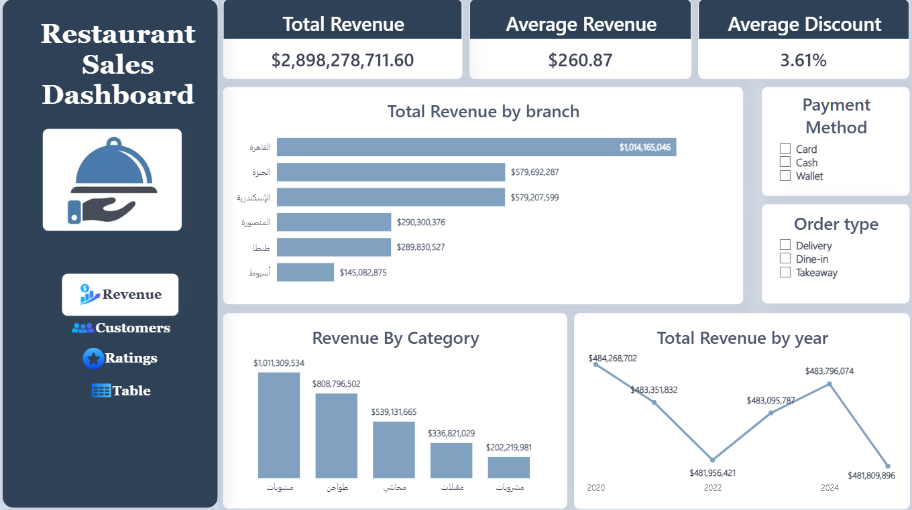
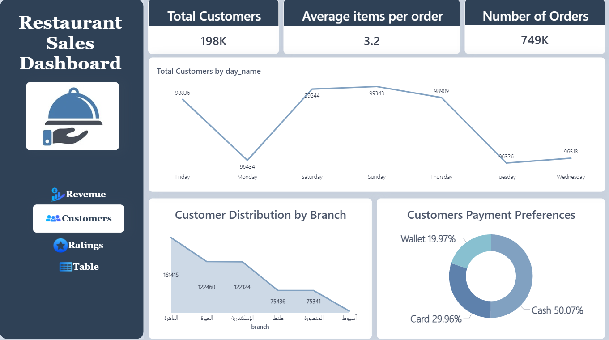
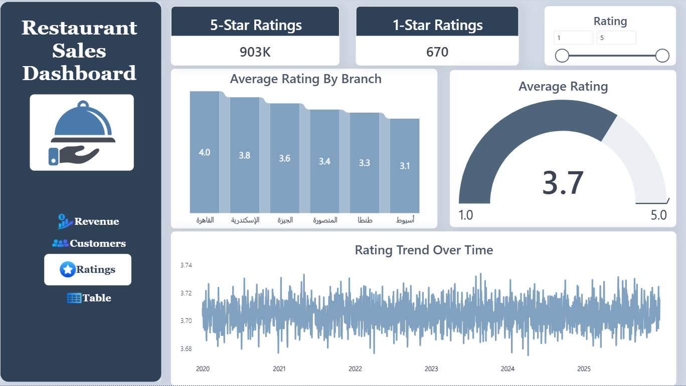
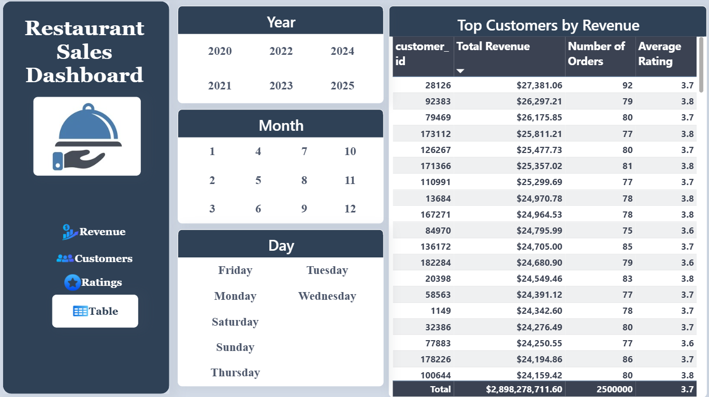

# Restaurant Sales Analytics Pipeline

A full end-to-end data analytics project covering data ingestion, processing, and interactive dashboarding for a multi-branch Egyptian restaurant chain.

---

## Project Overview

This project processes over **11 million restaurant orders** across **6 Egyptian branches** (2020–2025), builds an optimized data pipeline using **Databricks** and **Delta Lake**, and delivers a 4-page interactive **Power BI** dashboard covering revenue, customers, ratings, and detailed filtering.

---

## Page 1 - Revenue 



> Total Revenue: **$2.89B** | Average Order Value: **$260.87** | Average Discount: **3.61%**
>
> Includes total revenue by branch (القاهرة leads at $1B+), revenue by food category, year-over-year revenue trend, and slicers for payment method and order type.

---

### Page 2 — Customers


> Total Customers: **198K** | Average Items per Order: **3.2** | Total Orders: **749K**
>
> Includes customer count by day of week, customer distribution by branch (area chart), and payment preference breakdown (Cash 50%, Card 30%, Wallet 20%).

---

### Page 3 — Ratings


> 5-Star Ratings: **903K** | 1-Star Ratings: **670** | Overall Average Rating: **3.7 / 5.0**
>
> Includes average rating by branch bar chart, gauge chart showing overall rating vs scale (1.0–5.0), rating trend over time (2020–2025), and an interactive rating slicer.

---

### Page 4 — Table & Filters


> Full interactive filter panel with Year, Month, and Day slicers.
>
> Includes top customers ranked by total revenue, with number of orders and average rating per customer. Customer 28126 is the highest spender at $27,381.

---

## Tech Stack

| Layer | Technology |
|---|---|
| Raw storage | Databricks File System (DBFS) |
| Optimized storage | Delta Lake (partitioned by year/month) |
| Aggregation | Databricks SQL |
| Visualization | Microsoft Power BI Desktop |

---

## Data Schema

All 10 source files (8 CSV + 2 JSON):

| Column | Type | Description |
|---|---|---|
| `order_id` | Integer | Unique order identifier |
| `order_date` | Date | Order date (yyyy-MM-dd) |
| `hour` | Integer | Hour of order (0–23) |
| `category` | String | Arabic food category (e.g. مشويات، مشروبات) |
| `item_name` | String | Arabic menu item name |
| `price` | Float | Unit price in EGP |
| `quantity` | Integer | Number of items ordered |
| `discount` | Float | Discount rate (0.1 = 10%) |
| `total_amount` | Float | Final order value in EGP |
| `branch` | String | Branch city in Arabic (6 branches) |
| `payment_method` | String | Cash / Card / Wallet |
| `order_type` | String | Dine-in / Takeaway / Delivery |
| `customer_id` | Integer | Customer identifier |
| `rating` | Integer | Customer rating (1–5) |
| `is_weekend` | Integer | 1 = Friday/Saturday, 0 = weekday |

---

## Pipeline Architecture

```
8 CSV files ──┐
              ├──► Clean & Combine ──► Delta Lake ──► Summary Tables ──► Power BI
2 JSON files ─┘
```

### Stage 1 — Ingest
Read all source files into Databricks.

### Stage 2 — Clean & Combine
Standardize column types, cast dates, add derived columns (year, month, Day Type), and union all 10 sources into one 11M-row DataFrame.

### Stage 3 — Delta Lake
Save as a partitioned Delta table with OPTIMIZE and ZORDER on branch and order_date for fast query performance.

### Stage 4 — Summary Tables
Pre-aggregate into 3 lightweight tables for Power BI:
- `summary_branch_monthly` — revenue and ratings by branch and month
- `summary_category` — revenue and discount by food category
- `summary_hourly` — order volume and value by hour and day type

### Stage 5 — Power BI
Connect via Databricks SQL Warehouse connector in Import mode. Build 4 report pages with 30+ visuals, DAX measures, and interactive slicers.

---

## Key DAX Measures

```dax
-- Total Revenue
Total Revenue = SUM(fullrestaurant[total_amount])

-- Average Rating
Average Rating = AVERAGE(fullrestaurant[rating])

-- Target Rating
Target_rating = 5.00

-- Rating vs Target
avg vs current rating = [Target_rating] - [Average Rating]

--Total Customers 
Total Customers = DISTINCTCOUNT(fullrestaurant[customer_id])

--Number of Orders
Number of Orders = DISTINCTCOUNT(fullrestaurant[order_id])

--Average_Revenue
Average_Revenue = AVERAGE (fullrestaurant[total_amount])

--Average_Discount
Average_Discount = AVERAGE(fullrestaurant[discount])

--average items
average items = AVERAGE(fullrestaurant[quantity])

--maxvalue
maxvalue = 5

--minvalue 
minvalue = 1

--1star rating
1star rating = CALCULATE(COUNTROWS('fullrestaurant'),'fullrestaurant'[rating] = 1)

--5stars
5stars = CALCULATE(COUNTROWS('fullrestaurant') , fullrestaurant[rating] = 5)
```
---

## Key Insights from the Data

- **القاهرة** is the highest revenue branch at over $1 billion, more than double the next branch
- **مشويات** (grilled meats) is the top-performing food category by revenue at $1.01B
- **Cash** is still the dominant payment method at 50%, with Wallet at only 20%
- **Overall average rating is 3.7/5.0** — below the 4.0 target, with أسيوط the lowest branch at 3.1
- **Monday** is the lowest traffic day while Friday–Sunday cluster as the busiest period
- Only **670 orders** received a 1-star rating vs **903K** receiving 5 stars — satisfaction is heavily skewed positive but the low-rating tail needs investigation

---

## Author
Mariam Ankeeb
